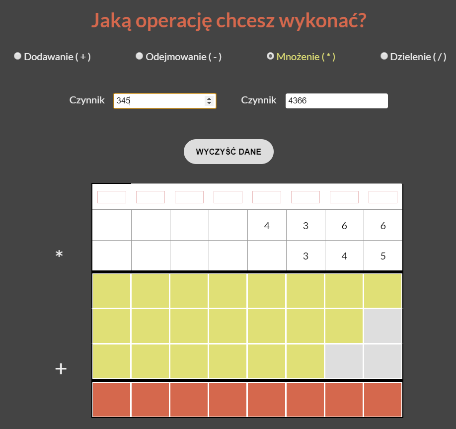

# Mathematical operations app

## Description
Application to help children with dynamically generated basic mathematical operations (+, -, *, /).

## Live preview
[Link](https://basic-math-operations.netlify.com/)

## Built with
- [Electron](https://electronjs.org/)
- Vue.js

## Screens
### Addition


### Subtraction


### Multiplication


### Division


## Project setup
```
npm install
```

### Compiles and hot-reloads for development
```
npm run serve || npm run electron:serve
```

### Compiles and minifies for production
```
npm run build || npm run electron:build
```

### Lints and fixes files
```
npm run lint
```

## License
MIT © [Weronika Kędziora](https://github.com/Hobbytowo)
